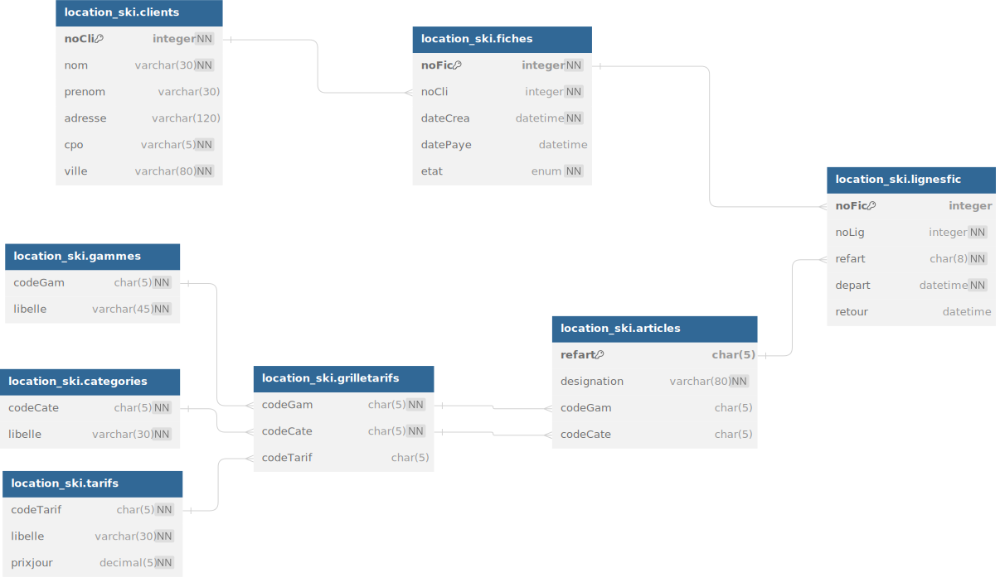

# TP99 - location_ski

## Diagramme

```dbml
Table location_ski.clients {
  noCli integer [primary key, not null]
  nom varchar(30) [not null]
  prenom varchar(30)
  adresse varchar(120)
  cpo varchar(5) [not null]
  ville varchar(80) [not null]
}

Table location_ski.fiches {
  noFic integer [primary key, not null]
  noCli integer [not null]
  dateCrea datetime [not null]
  datePaye datetime
  etat enum [not null]
}

Table location_ski.lignesfic {
  noFic integer [primary key]
  noLig integer [not null]
  refart char(8) [not null]
  depart datetime [not null]
  retour datetime
}

Table location_ski.articles {
  refart char(5) [primary key]
  designation varchar(80) [not null]
  codeGam char(5)
  codeCate char(5)
}

Table location_ski.grilletarifs {
  codeGam char(5) [not null]
  codeCate char(5) [not null]
  codeTarif char(5)
}

Table location_ski.gammes {
  codeGam char(5) [not null]
  libelle varchar(45) [not null]
}

Table location_ski.categories {
  codeCate char(5) [not null]
  libelle varchar(30) [not null]
}

Table location_ski.tarifs {
  codeTarif char(5) [not null]
  libelle varchar(30) [not null]
  prixjour decimal(5) [not null]
}

Ref: "location_ski"."categories"."codeCate" < "location_ski"."grilletarifs"."codeCate"

Ref: "location_ski"."tarifs"."codeTarif" < "location_ski"."grilletarifs"."codeTarif"

Ref: "location_ski"."gammes"."codeGam" < "location_ski"."grilletarifs"."codeGam"

Ref: "location_ski"."grilletarifs"."codeGam" < "location_ski"."articles"."codeGam"

Ref: "location_ski"."grilletarifs"."codeCate" < "location_ski"."articles"."codeCate"

Ref: "location_ski"."articles"."refart" < "location_ski"."lignesfic"."refart"

Ref: "location_ski"."lignesfic"."noFic" > "location_ski"."fiches"."noFic"

Ref: "location_ski"."fiches"."noCli" > "location_ski"."clients"."noCli"
```

## Création BDD

```mysql
DROP DATABASE IF EXISTS location_skis;

CREATE DATABASE IF NOT EXISTS location_skis;

USE location_skis;

CREATE TABLE clients (
    noCli INT AUTO_INCREMENT PRIMARY KEY,
    nom VARCHAR(30) NOT NULL,
    prenom VARCHAR(30),
    adresse VARCHAR(120),
    cpo VARCHAR(5) NOT NULL,
    ville VARCHAR(80) NOT NULL
) ENGINE=InnoDB;

CREATE TABLE fiches (
    noFic INT AUTO_INCREMENT PRIMARY KEY,
    noCli INT NOT NULL,
    dateCrea DATETIME NOT NULL,
    datePaye DATETIME,
    etat ENUM('SO', 'EC', 'RE') NOT NULL,
    FOREIGN KEY (noCli) REFERENCES clients(noCli)
) ENGINE=InnoDB;

CREATE TABLE gammes (
    codeGam CHAR(5) PRIMARY KEY,
    libelle VARCHAR(30) NOT NULL
) ENGINE=InnoDB;

CREATE TABLE categories (
    codeCate CHAR(5) PRIMARY KEY,
    libelle VARCHAR(30) NOT NULL
) ENGINE=InnoDB;

CREATE TABLE tarifs (
    codeTarif CHAR(5) PRIMARY KEY,
    libelle VARCHAR(30) NOT NULL,
    prixJour FLOAT NOT NULL
) ENGINE=InnoDB;

CREATE TABLE grilletarifs (
    codeGam CHAR(5),
    codeCate CHAR(5) NOT NULL,
    codeTarif CHAR(5),
    FOREIGN KEY (codeGam) REFERENCES gammes(codeGam),
    FOREIGN KEY (codeTarif) REFERENCES tarifs(codeTarif),
    FOREIGN KEY (codeCate) REFERENCES categories(codeCate)
) ENGINE=InnoDB;

CREATE TABLE articles (
    refart CHAR(8) PRIMARY KEY,
    designation VARCHAR(80) NOT NULL,
    codeGam CHAR(5),
    codeCate CHAR(5),
    FOREIGN KEY (codeGam) REFERENCES gammes(codeGam),
    FOREIGN KEY (codeCate) REFERENCES categories(codeCate)
) ENGINE=InnoDB;

CREATE TABLE lignesfic (
    noFic INT,
    noLig INT,
    refart CHAR(8) NOT NULL,
    depart DATETIME NOT NULL,
    retour DATETIME,
    FOREIGN KEY (noFic) REFERENCES fiches(noFic),
    FOREIGN KEY (refart) REFERENCES articles(refart)
) ENGINE=InnoDB;
```

## Requêtes 
```mysql

```